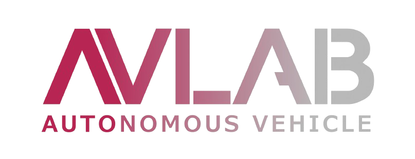
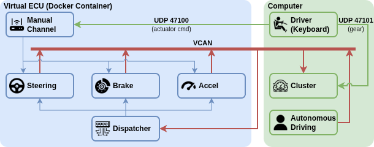

# ioniq5-vecu

<br clear="all">

A **virtual Target ECU (vECU)** for IONIQ5 VILS. Even without the three real actuator
controllers (steering ADA-S, braking ADA-B, acceleration ADE-A), a Docker container
emulates them and exchanges the same CAN frames as the real hardware over a virtual
CAN bus (vcan0). On the host (laptop) the state is shown on an IONIQ5-style web cluster
and driven manually from the keyboard.

> Maintained by the **Autonomous Vehicle Laboratory (AVLAB)**, Chungbuk National University.

## Architecture (role separation)



- **The dbc files are the single source of truth for the CAN matrix.** All
  encoding/decoding goes through cantools using `dbc/*.dbc` (no magic numbers). The
  `dbc/` files are committed, so the project runs out of the box.
- **Manual control is sent over a localhost UDP side channel, not vcan0** (the official
  matrix has no message for "a human moves it by hand"). Only spec frames flow on vcan0.
- **Speed is not in the matrix**, so it is derived from acceleration/braking on the
  display side (`console/vehicle_model.py`).

## Execution environment

- **OS:** Ubuntu 22.04 LTS
- **Python:** developed and tested on 3.10 (the host console also runs on 3.8+).

## Quick start

### 1. Bring up the virtual CAN on the host (once)
**`can-utils` is required** - the lab procedure uses `candump` to verify the bus, so
install it before anything else (`ip`/`modprobe` are already on a standard Ubuntu host).
```bash
sudo apt install can-utils       # REQUIRED - candump/cansend (Debian/Ubuntu)
./scripts/setup_vcan.sh          # modprobe vcan + create/up vcan0
candump vcan0                    # leave running to verify - frames appear once the vECU starts
```

### 2. Run the vECU (native)
`.venv` is not tracked by git (.gitignore), so create it fresh after cloning.
```bash
python3 -m venv .venv                            # on Debian/Ubuntu first: sudo apt install python3-venv
.venv/bin/pip install -r requirements.txt        # python-can / cantools / openpyxl / pygame

# vECU runtime (steering + braking + acceleration, one shared bus)
PYTHONPATH=src .venv/bin/python -m ioniq5_vecu.vecu
```

### 3. Cluster + keyboard (host-native)
```bash
.venv/bin/python console/cluster.py                 # http://127.0.0.1:8088 (stdlib only)
.venv/bin/python console/input.py                   # Left/Right steer, Up accel, Down brake
```
> Car images live in `console/assets/` (`ioniq5_basic.png`, `ioniq5_brake.png`); a
> fallback render is used if they are missing.

### Teardown
```bash
./scripts/setdown_vcan.sh        # down + remove vcan0
```

## Docker (optional)

The container ships only Role 1 (the headless Target ECU); the GUI runs host-native.
```bash
docker compose -f docker/docker-compose.yml up --build
docker compose -f docker/docker-compose.yml down     # stop AND remove the container + network
```
> `Ctrl+C` on `up` only **stops** the container (it stays as `Exited` in `docker ps -a`);
> `down` also **removes** it (containers + compose network). To do both in one step —
> run in the foreground and auto-remove on `Ctrl+C` — use the helper script:
> ```bash
> ./scripts/run_docker.sh            # up --build, then `down` on exit (Ctrl+C included)
> ```
> The image bundles only the committed `src/` and `dbc/` (the dbc files are the single
> source of truth), so there is no build-time generation step.

## Running a single ECU (debugging)

Instead of the integrated runner you can bring up one actuator at a time (use
`--no-manual` to avoid UDP-port clashes when running several). `--demo` injects a
SON/override + target triangle wave.
```bash
PYTHONPATH=src .venv/bin/python -m ioniq5_vecu.ecus.steering --demo
PYTHONPATH=src .venv/bin/python -m ioniq5_vecu.ecus.brake --demo
PYTHONPATH=src .venv/bin/python -m ioniq5_vecu.ecus.accel --demo
candump vcan0                    # inspect frames (can-utils, installed in step 1)
```

## Directory layout
```
dbc/               Generated CAN definitions - single source of truth (pre-committed)
src/ioniq5_vecu/   Role 1: Target ECU (container, headless)
console/           Role 2: web cluster GUI + keyboard input (host-native)
scripts/           vcan0 setup / teardown
docker/            Dockerfile.vecu, docker-compose.yml (network_mode: host)
docs/              architecture diagram, lab logo
```

---

## Maintainer

Junhyeok Seo — jun2342@chungbuk.ac.kr
Autonomous Vehicle Laboratory (AVLAB), Chungbuk National University
