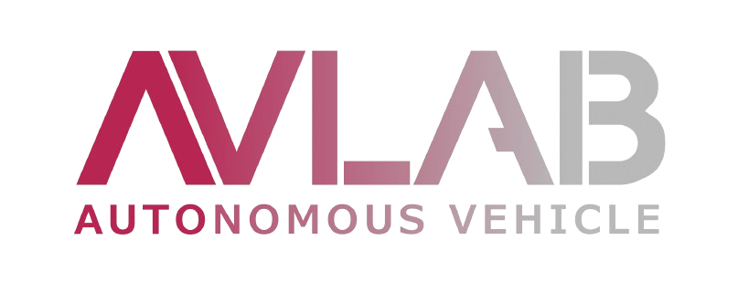
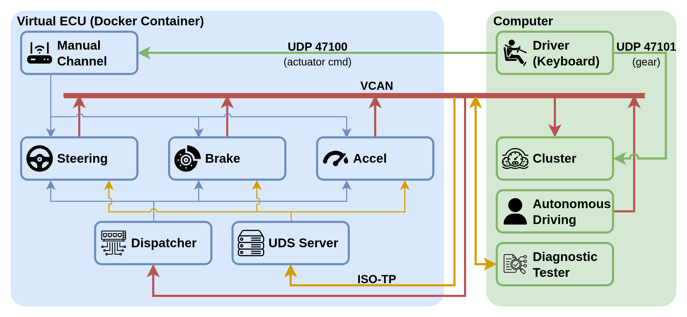

# ioniq5-vecu

<br clear="all">

A **virtual Target ECU (vECU)** for IONIQ5 VILS. Even without the three real actuator
controllers (steering ADA-S, braking ADA-B, acceleration ADE-A), a Docker container
emulates them and exchanges the same CAN frames as the real hardware over a virtual
CAN bus (vcan0). On the host (laptop) the state is shown on an IONIQ5-style web cluster
and driven manually from the keyboard. The ECUs also answer **UDS diagnostics
(ISO 14229 / ISO 15765-2)**.

> Maintained by the **Autonomous Vehicle Laboratory (AVLAB)**, Chungbuk National University.

## Architecture



- All CAN encoding and decoding goes through cantools with the committed `dbc/*.dbc`.
- Manual control is sent over a localhost UDP side channel; only CAN-matrix frames flow on vcan0.
- Speed is not in the CAN matrix; the cluster derives it from acceleration and braking
  (`console/vehicle_model.py`).
- UDS diagnostics use the 0x7xx IDs and send nothing until a request arrives.

## Execution environment

- **OS:** Ubuntu 22.04 LTS
- **Python:** developed and tested on 3.10 (the host console and practice scripts also run on 3.8+).

## Quick start

### 1. Bring up the virtual CAN on the host (once)
**`can-utils` is required** (`candump` / `cansend`).
```bash
sudo apt install can-utils       # candump / cansend (Debian/Ubuntu)
./scripts/setup_vcan.sh          # modprobe vcan + create/up vcan0
candump vcan0                    # frames appear once the vECU starts
```

### 2. Run the vECU (native)
`.venv` is not tracked by git, so create it after cloning.
```bash
python3 -m venv .venv                            # on Debian/Ubuntu first: sudo apt install python3-venv
.venv/bin/pip install -r requirements.txt

# steering + braking + acceleration + UDS diagnostics
PYTHONPATH=src .venv/bin/python -m ioniq5_vecu.vecu
```
Options: `--no-diag` disables UDS diagnostics, `--no-manual` disables the manual UDP channel,
`--channel` / `--interface` select the bus.

### 3. Cluster + keyboard (host-native)
```bash
.venv/bin/python console/cluster.py                 # http://127.0.0.1:8088
.venv/bin/python console/input.py                   # Left/Right steer, Up accel, Down brake, P/R/N/D gear
```

### Teardown
```bash
./scripts/setdown_vcan.sh        # down + remove vcan0
```

## Docker (optional)

The container runs only the vECU; the cluster, keyboard input and practice scripts run on the host.
```bash
docker compose -f docker/docker-compose.yml up --build
docker compose -f docker/docker-compose.yml down     # stop and remove the container + network
```
To run in the foreground and remove the container on exit (Ctrl+C included):
```bash
./scripts/run_docker.sh
```

## CAN control

| Actuator | Node | Command (RX) | Status (TX) | Unit · range |
|---|---|---|---|---|
| Steering | ADA-S | `0x100` SON, `0x101` target_pos | `0x104` encoder_pos, `0x105` status bits, `0x106` FSM | deg, ±480 |
| Brake | ADA-B | `0x200` SON, `0x201` target_pos | `0x204`, `0x205`, `0x206` | mm, 0~170 |
| Accel | ADE-A | `0x311` override command | `0x314` percent / flags, `0x315` voltages | %, V |

```bash
cansend vcan0 100#E701FF        # steering servo ON (SON=1)
cansend vcan0 101#18150000      # target_pos = 90.0 deg
cansend vcan0 201#D0070000      # brake target_pos = 20.0 mm
candump vcan0,104:7FF           # steering feedback only
```
More examples and the byte calculations: [practice/01_can_manual.md](practice/01_can_manual.md).

## UDS diagnostics

| ECU | Request (tester -> ECU) | Response (ECU -> tester) |
|---|---|---|
| ADA-S | `0x7A0` | `0x7A8` |
| ADA-B | `0x7B0` | `0x7B8` |
| ADE-A | `0x7C0` | `0x7C8` |

Services: `0x10` session control, `0x11` ECU reset, `0x14` clear DTCs, `0x19` read DTCs,
`0x22` read DID, `0x27` security access, `0x2E` write DID, `0x31` routine control, `0x3E` tester present.

| DID | Content | Write |
|---|---|---|
| `0xF190` / `0xF195` / `0xF18C` | VIN / SW version / serial number | – |
| `0x0100` / `0x0101` / `0x0102` | position (0.1 units) / FSM state / SON | – |
| `0x0110` / `0x0111` / `0x0112` | limit_min / limit_max / max_speed | extended session + security access |
| `0x0120` / `0x0121` / `0x0122` | (ADE-A) override active / override % / CAL_EN | – |

Routines: `0x0201` zero calibration, `0x0202` fault injection, `0x0203` fault clear.
Fault injection sets ALM/RD in `0x105` to 0 and the FSM state in `0x106` to 6 (warning),
and records a DTC. The full DID table is in
[src/ioniq5_vecu/diag/did_registry.py](src/ioniq5_vecu/diag/did_registry.py).

```bash
candump vcan0,7A0:7F8,7A8:7F8                 # diagnostic frames only
cansend vcan0 7A0#0322F19500000000            # 22 F1 95 (read the SW version)
```

## Practice

```bash
.venv/bin/python practice/02_can_python.py     # sweep the steering through the dbc
.venv/bin/python practice/03_uds_client.py     # run a diagnostic sequence with udsoncan
```
Both scripts are fill-in-the-blank exercises: replace each `____`. An unfilled blank raises
`NameError` on that line. [practice/01_can_manual.md](practice/01_can_manual.md) is a
`cansend` / `candump` cheat sheet.

## Running a single ECU (debugging)

Runs one actuator without the integrated runner (no UDS diagnostics). Use `--no-manual`
when running several at once to avoid UDP port clashes. `--demo` injects SON/override
plus a target triangle wave.
```bash
PYTHONPATH=src .venv/bin/python -m ioniq5_vecu.ecus.steering --demo
PYTHONPATH=src .venv/bin/python -m ioniq5_vecu.ecus.brake --demo
PYTHONPATH=src .venv/bin/python -m ioniq5_vecu.ecus.accel --demo
candump vcan0
```

## Directory layout
```
dbc/               CAN definitions (committed)
src/ioniq5_vecu/   vECU (container, headless)
       diag/       UDS diagnostic layer
console/           web cluster + keyboard input (host)
practice/          exercises (host)
scripts/           vcan0 setup / teardown, Docker helper
docker/            Dockerfile.vecu, docker-compose.yml (network_mode: host)
docs/              architecture diagram, lab logo
```
---

## License

Part of the IONIQ5 VILS course materials; noncommercial use only.
(This repo is the `vecu/` submodule of the course repo — the terms below apply,
not the parent repo's license.)

| Scope | License |
|-------|---------|
| Entire repo (code, docs, diagrams; excluding `dbc/`) | [PolyForm Noncommercial 1.0.0](LICENSE.txt) |
| **CAN matrix (`dbc/`)** | **Not covered by the license above** — see [dbc/NOTICE.txt](dbc/NOTICE.txt) |

Use, modification, and redistribution for teaching, research, or personal study are
permitted under PolyForm's *Noncommercial Organizations* / *Personal Uses* clauses.
Commercial use is not permitted.

> ⚠️ **`dbc/` is an exception.** The copyright holder of the CAN matrix is the
> controller supplier, not the lab. The supplier granted permission **solely for
> publication in this repo**; no rights to redistribute, mirror, or create derivative
> works are granted beyond that. Any use beyond following the course materials
> requires separate permission from the supplier. Be sure to read
> [dbc/NOTICE.txt](dbc/NOTICE.txt) for details.

---

## Maintainer

Junhyeok Seo — jun2342@chungbuk.ac.kr
Autonomous Vehicle Laboratory (AVLAB), Chungbuk National University
